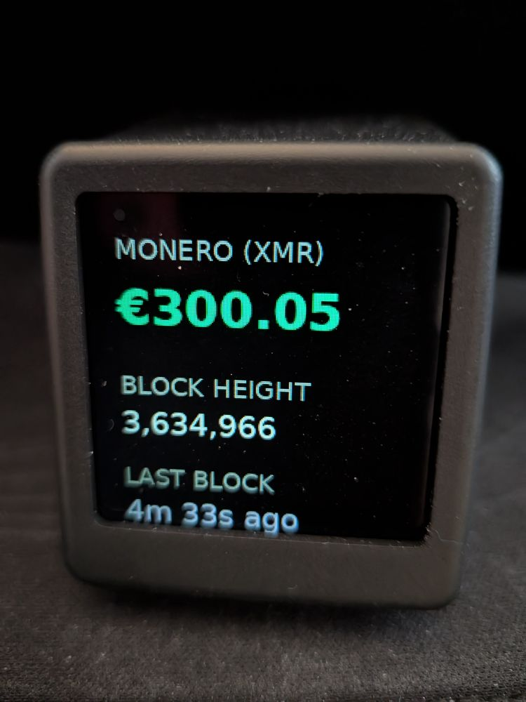
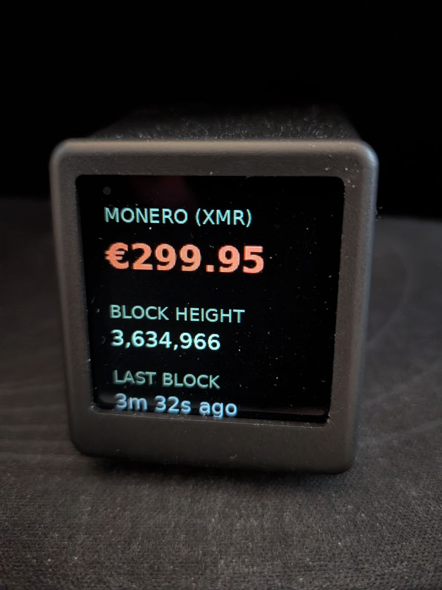

# XMR-Tracker

A roundabout way of turning a **GeekMagic SmallTV-Ultra** into a live Monero (XMR) tracker by generating images with a python script and loading them into the "Pictures" storage.

Features the current block height, time since last block and a ticker with colors changing depending on the last price movement.

## Images
| Green | Red |
| :---: | :---: |
|  |  |

---

##  Configuration

To get the tracker running, you need to point the script to your specific device. Open the configuration file and enter the local IP address of your SmallTV-Ultra:

```python
DEVICE_IP = "enter_IP_here"
```
## Important Note on Update Frequency

You can adjust how often the tracker fetches and pushes new data, but please be aware of the hardware limitations:

Warning: Lowering the ```UPDATE_INTERVAL``` makes the tracker more accurate and responsive, but at the cost of burning out the SmallTV-Ultra's internal flash memory much quicker.
